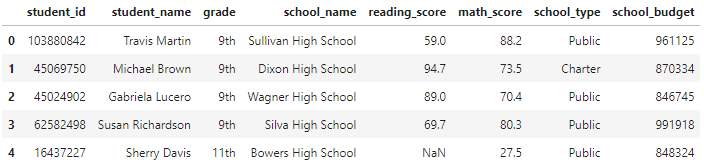
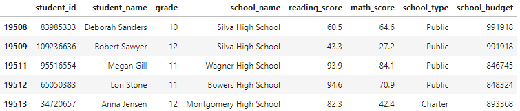

# Election Audit with Python

## Overview of Project
The purpose of this project was to assist Maria, the chief data scientist for PyCity Schools, with an analysis on student funding and students' standardized test scores. We were tasked with:
1. Collecting the data utilizing a pandas DataFrame
2. Pepare the data by cleaning it
3. Summarize the key peices of the data
4. Drill down into the data to analyze specific subsets
5. Compare and contrast the data through grouping and aggregation
6. Provide a written analysis of our findings

## Results

By collecting and reading our data, we can determine our dataset has 8 columns and 19,513 rows.

 

Preparing the data, we noticed many missing inputs for reading and math scores. With the size of our dataset, we decided to drop the missing values, as well as any instances of duplicated data (1,836 records).

With further analysis, we calculated the average math score is 64.7 and the minimum reading score was given to a student at Dixon High School, receiving a score of 10.5. Public schools also had a higher school budget than charter schools according to our comparisons. The school with the greatest number of students was Montgomery High School with 2038 students. Chang High School had the lowest number of students, with only 171. Lastly, 9th graders in charter schools had an average math score of 70.0, 6 more points than their equivalent grade level in public schools.
